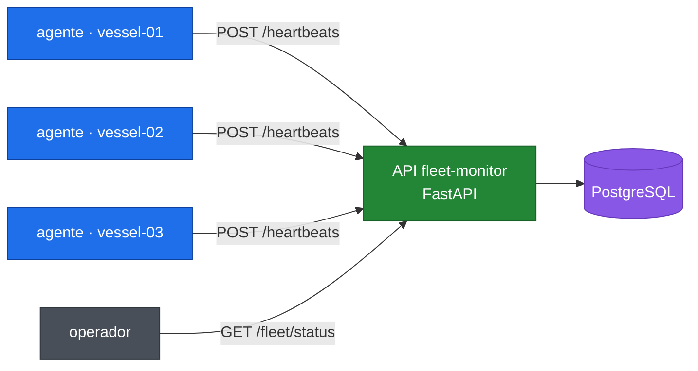

<!-- Selector de idioma. GitHub sanea el HTML, así que un enlace es la forma portable. -->
[English](README.md) · **Español**

# fleet-monitor

[](https://github.com/julianAO2002/fleet-monitor/actions/workflows/ci.yml)
[](https://www.python.org/)
[](Dockerfile)
[](LICENSE)

**Un laboratorio de despliegue para flotas de nodos remotos con conectividad
intermitente.** Los barcos reportan a una API central, que deriva el estado de
cada nodo a partir de cuánto hace que está en silencio — de modo que un barco
que pierde su enlace satelital es detectado precisamente porque se calló.

La aplicación es deliberadamente chica. El objeto de este repositorio es la
envoltura DevOps que la rodea: contenedores, un entorno declarado, integración
continua y un camino documentado hacia producción.

---

## Arquitectura



Cada agente se registra al arrancar y reporta métricas y su versión de software
cada 30 segundos. La API guarda los reportes y responde una sola pregunta para
el operador: cuál es el estado de la flota en este momento.

---

## Cómo arrancar

Tres comandos. Docker es el único requisito.

```bash
git clone https://github.com/julianAO2002/fleet-monitor.git
cd fleet-monitor
cp .env.example .env
make demo
```

`make demo` construye las dos imágenes y levanta cinco contenedores:
PostgreSQL, la API y tres agentes de barco.

Después:

| | |
|---|---|
| Documentación interactiva | <http://localhost:8000/docs> |
| Resumen de la flota | <http://localhost:8000/api/fleet/status> |
| Salud | <http://localhost:8000/health> |

```bash
make ps       # qué está corriendo, y si está sano
make logs     # seguir los logs de todos los servicios
make status   # resumen actual de la flota
make down     # apagar, conservando los datos
make clean    # apagar y borrar el volumen de la base
```

Sin `make`, cada objetivo es un comando Docker común — ver el
[Makefile](Makefile).

### Ver un barco quedarse sin conexión

La demostración que justifica este proyecto:

```bash
docker stop fleet-monitor-agent-1     # un barco pierde el enlace
make status                           # a los 2 min:  STALE
                                      # a los 10 min: OFFLINE
docker start fleet-monitor-agent-1    # vuelve el enlace
make status                           # ONLINE de nuevo en el próximo heartbeat
```

Nadie escribe un estado en ningún lado. El propio silencio del nodo es lo que
lo cambia.

---

## Endpoints

| Método | Ruta | Para qué |
|---|---|---|
| `GET` | `/health` | Vivo, más conexión a la base. Lo usa el healthcheck del contenedor |
| `POST` | `/api/nodes` | Registra un nodo |
| `GET` | `/api/nodes` | Lista los nodos con su estado calculado |
| `GET` | `/api/nodes/{id}` | Un nodo en particular |
| `POST` | `/api/nodes/{id}/heartbeats` | El agente reporta métricas y versión |
| `GET` | `/api/nodes/{id}/heartbeats` | Los últimos reportes de ese nodo |
| `GET` | `/api/fleet/status` | Totales por estado, y qué versiones están corriendo |

`GET /api/fleet/status` devuelve la respuesta que importa operativamente:

```json
{
  "total": 200,
  "online": 187,
  "stale": 9,
  "offline": 4,
  "versions": { "1.5.0": 180, "1.4.2": 20 }
}
```

Veinte barcos nunca recibieron la actualización. Ese número es la razón por la
que la versión viaja en cada heartbeat.

---

## Decisiones técnicas

### El estado se calcula, nunca se guarda

No hay columna `status`. La alcanzabilidad se calcula a partir de
`last_seen_at` al momento de consultar.

```
silencio < 2 min  →  ONLINE
2–10 min          →  STALE      (conectividad intermitente)
> 10 min          →  OFFLINE
```

Un estado guardado se desactualiza solo: un barco que se queda sin energía deja
de reportar *y* deja de poder corregir su propia fila, así que la base seguiría
diciendo ONLINE para siempre. Un estado derivado se recalcula en cada lectura y
no puede mentir.

Es verificable: cambiando únicamente `last_seen_at` un nodo recorre los tres
estados sin que se escriba nada más.

### Imagen multi-stage: 203 MB → 71 MB

La etapa builder instala las dependencias; la etapa runtime arranca de una base
limpia y copia solamente el virtualenv terminado, dejando atrás el compilador y
los caches de pip.

| | transferido | en disco |
|---|---|---|
| un solo stage | 203 MB | 785 MB |
| multi-stage | **71 MB** | 301 MB |

En una flota de doscientos barcos con enlaces satelitales medidos, esa
diferencia son unos 26 GB por despliegue. [`Dockerfile.single`](Dockerfile.single)
se conserva para que la comparación sea reproducible y no una afirmación.

### Corre como usuario sin privilegios

Root es el default de Docker, y es el default equivocado. Un proceso que se
escape de la aplicación cae como un usuario que no posee nada: escribir en
`/etc` dentro del contenedor en ejecución está denegado.

### La configuración viene del entorno

Nada está escrito en el código. La misma imagen corre en desarrollo, staging y
producción sin recompilarse — solo cambia la configuración inyectada. Eso
además mantiene las credenciales fuera de la imagen, donde cualquiera que la
descargue podría leerlas. [`.env`](.env.example) está ignorado por Git;
`.env.example` tiene valores de ejemplo.

### El reloj es un parámetro

`compute_status` recibe la hora actual en lugar de leerla. Eso es lo que
permite que la suite de tests recorra una transición de diez minutos en
microsegundos, verificando los límites exactos — 119s ONLINE, 120s STALE, 599s
STALE, 600s OFFLINE — que es donde se escondería un error de un solo número.

### Las dependencias se inyectan, no se importan

Los handlers reciben su sesión de base de datos a través de `Depends` de
FastAPI. Sustituir dos dependencias en `conftest.py` fue toda la adaptación
necesaria para correr los handlers reales contra una base descartable. Ningún
módulo de la aplicación sabe que está siendo testeado.

### El umbral de estado es cuatro veces el intervalo de reporte

Los agentes reportan cada 30 segundos; un nodo se marca STALE a los 120. Tiene
que perder cuatro reportes consecutivos para figurar como inalcanzable, lo que
absorbe un paquete perdido sin poner el tablero en amarillo. Un operador que ve
falsas alarmas todos los días deja de mirar el tablero — y después se pierde la
alarma real.

---

## Tests

```bash
pip install -r requirements.txt -r requirements-dev.txt
pytest
```

32 tests en menos de un segundo, contra una base creada y descartada por cada
test. CI corre la misma suite dos veces: una contra SQLite por velocidad, otra
contra PostgreSQL 16 porque SQLite es permisivo en aspectos en los que el motor
real no lo es.

---

## Integración continua

Cada push y cada pull request ejecutan [tres jobs](.github/workflows/ci.yml):

```
lint    ruff check + ruff format --check
test    pytest contra SQLite, después contra PostgreSQL 16
build   needs: [lint, test] — imágenes construidas, arrancadas y verificadas
```

`build` declara `needs`, así que un commit que falla nunca produce una imagen
desplegable. El job de build arranca el contenedor, consulta `/health` y
confirma que corre como `appuser` — una imagen que se construye no es lo mismo
que una que funciona.

No se publica nada en un registro. **Esto es integración continua y termina
ahí**; publicar y desplegar sería entrega continua, cosa que este proyecto
deliberadamente no hace.

---

## Estructura del repositorio

```
fleet-monitor/
├── app/                     la API central
│   ├── config.py            el único módulo que lee el entorno
│   ├── models.py            tablas Node y Heartbeat
│   ├── database.py          engine y sesión por request
│   ├── status.py            la regla ONLINE/STALE/OFFLINE
│   ├── schemas.py           contratos de entrada y salida
│   └── routers/             handlers HTTP
├── agent/                   el agente de barco y su imagen
├── tests/                   32 tests, base aislada
├── deploy/README.md         cómo esto llega a una flota real
├── .github/workflows/ci.yml lint, test, build
├── Dockerfile               multi-stage, sin root, con healthcheck
└── docker-compose.yml       el entorno completo, declarado
```

---

## Desplegar en una flota real

[**`deploy/README.es.md`**](deploy/README.es.md) describe cómo esto llegaría a
doscientos barcos: por qué el despliegue se basa en que el nodo tire la
configuración en lugar de empujársela, cómo el repositorio declara el estado
deseado mientras los agentes reportan el estado observado, y qué partes están
implementadas frente a cuáles son diseño.

---

## Limitaciones y próximos pasos

Dicho sin vueltas, porque un README que exagera su alcance es peor que uno que
admite sus bordes.

**No hay autenticación.** Cualquier cliente que alcance la API puede registrar
un nodo o publicar un heartbeat. Un despliegue real necesita credenciales por
barco — que además serían la forma en que la API sabría que un reporte es
genuino.

**El resumen de flota no escala indefinidamente.** `/api/fleet/status` carga
todos los nodos y cuenta en Python. Alcanza para doscientos; con cincuenta mil
debería ser una consulta agregada en la base.

**Integración continua, no despliegue.** Las imágenes se construyen y se
verifican, nunca se publican. No hay registro ni proceso de release.

**El agente de sincronización a bordo está diseñado, no construido.** El
repositorio puede declarar el estado deseado, pero todavía no hay nada en el
barco que lo tire. Es la mitad faltante del ciclo descrito en
`deploy/README.es.md`.

**El sistema no puede decir *por qué* un nodo está atrasado.** Informa que
veinte barcos corren una versión vieja, no si les faltó conectividad, se
quedaron sin disco o fueron excluidos a propósito — y cada caso necesita una
respuesta distinta. Cerrar esa brecha implica que el agente reporte su último
intento de sincronización, su disco libre y hace cuánto que no alcanza el
repositorio. **Es la función más valiosa que todavía no está construida.**

**Los cambios de esquema son solo aditivos.** `init_db` crea las tablas que
faltan y nada más. Modificar una columna sin perder datos requiere una
herramienta de migraciones como Alembic.

**El agente reporta métricas simuladas.** Uno real leería `/proc/stat`,
`statvfs` y `/proc/uptime`. El contrato con la API es idéntico en ambos casos,
que es justamente por qué el lado central no se ve afectado por la diferencia.

---

## Stack

| Capa | Elección | Por qué |
|---|---|---|
| Lenguaje | Python 3.12 | |
| API | FastAPI | Documentación OpenAPI automática en `/docs` |
| ORM | SQLModel | SQLAlchemy y Pydantic en una sola definición de clase |
| Base | PostgreSQL 16 | Estándar de la industria, corre en contenedor |
| Tests | pytest + httpx | |
| Lint | ruff | Linter y formateador en una sola herramienta rápida |
| Contenedores | Docker + Compose | |
| CI | GitHub Actions | |

---

## Autor

**Julián Agustín Olivera** — [github.com/julianAO2002](https://github.com/julianAO2002)

Licenciado bajo GPL-3.0. Ver [LICENSE](LICENSE).
