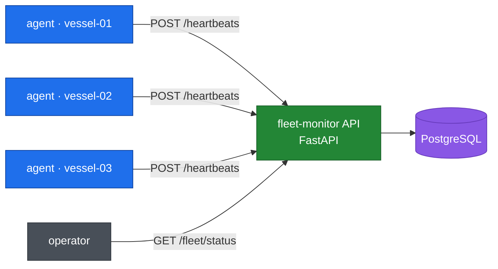

<!-- Language switcher. GitHub sanitises HTML, so a link is the portable form. -->
**English** · [Español](README.es.md)

# fleet-monitor

[](https://github.com/julianAO2002/fleet-monitor/actions/workflows/ci.yml)
[](https://www.python.org/)
[](Dockerfile)
[](LICENSE)

**A deployment laboratory for fleets of remote nodes with intermittent
connectivity.** Vessels report to a central API, which derives each node's
status from how long it has been silent — so a ship that loses its satellite
link is detected precisely because it went quiet.

The application is deliberately small. The subject of this repository is the
DevOps wrapper around it: containers, a declared environment, continuous
integration, and a documented path to production.

---

## Architecture



Each agent registers itself on startup and reports metrics and its software
version every 30 seconds. The API stores the reports and answers one question
for an operator: what is the state of the fleet right now.

---

## Getting started

Three commands. Docker is the only prerequisite.

```bash
git clone https://github.com/julianAO2002/fleet-monitor.git
cd fleet-monitor
cp .env.example .env
make demo
```

`make demo` builds both images and starts five containers: PostgreSQL, the API,
and three vessel agents.

Then:

| | |
|---|---|
| Interactive docs | <http://localhost:8000/docs> |
| Fleet summary | <http://localhost:8000/api/fleet/status> |
| Health | <http://localhost:8000/health> |

```bash
make ps       # what is running, and whether it is healthy
make logs     # follow every service
make status   # current fleet summary
make down     # stop, keeping recorded data
make clean    # stop and delete the database volume
```

Without `make`, every target is a plain Docker command — see the
[Makefile](Makefile).

### Watching a vessel go offline

The demonstration this project exists for:

```bash
docker stop fleet-monitor-agent-1     # a vessel loses its link
make status                           # after 2 min:  STALE
                                      # after 10 min: OFFLINE
docker start fleet-monitor-agent-1    # the link returns
make status                           # ONLINE again on the next heartbeat
```

Nothing writes a status anywhere. The node's own silence is what changes it.

---

## Endpoints

| Method | Path | Purpose |
|---|---|---|
| `GET` | `/health` | Liveness plus database connectivity. Used by the container healthcheck |
| `POST` | `/api/nodes` | Register a node |
| `GET` | `/api/nodes` | List nodes with their computed status |
| `GET` | `/api/nodes/{id}` | A single node |
| `POST` | `/api/nodes/{id}/heartbeats` | An agent reports metrics and version |
| `GET` | `/api/nodes/{id}/heartbeats` | That node's most recent reports |
| `GET` | `/api/fleet/status` | Totals per state, and which versions are running |

`GET /api/fleet/status` returns the operationally interesting answer:

```json
{
  "total": 200,
  "online": 187,
  "stale": 9,
  "offline": 4,
  "versions": { "1.5.0": 180, "1.4.2": 20 }
}
```

Twenty vessels never received the update. That number is the reason the version
travels on every heartbeat.

---

## Technical decisions

### Status is derived, never stored

There is no `status` column. Reachability is computed from `last_seen_at` at
query time.

```
silence < 2 min   →  ONLINE
2–10 min          →  STALE      (intermittent connectivity)
> 10 min          →  OFFLINE
```

A stored status goes stale on its own: a vessel that loses power stops
reporting *and* stops being able to correct its own row, so the database would
keep claiming ONLINE indefinitely. A derived status is recomputed on every read
and cannot lie.

This is verifiable — changing only `last_seen_at` moves a node through all
three states with nothing else written.

### Multi-stage image: 203 MB → 71 MB

The builder stage installs dependencies; the runtime stage starts from a clean
base and copies only the finished virtualenv, leaving the compiler and pip's
caches behind.

| | transferred | on disk |
|---|---|---|
| single-stage | 203 MB | 785 MB |
| multi-stage | **71 MB** | 301 MB |

Across a two-hundred-vessel fleet on metered satellite links, that difference
is roughly 26 GB per rollout. [`Dockerfile.single`](Dockerfile.single) is kept
so the comparison is reproducible rather than asserted.

### Runs as an unprivileged user

Root is Docker's default and it is the wrong default. A process that escapes
the application lands as a user that owns nothing: writing to `/etc` inside the
running container is denied.

### Configuration comes from the environment

Nothing is hardcoded. The same image runs in development, staging and
production without being rebuilt — only the injected configuration changes.
This also keeps credentials out of the image, where anyone pulling it could
read them. [`.env`](.env.example) is git-ignored; `.env.example` holds
placeholders.

### The clock is a parameter

`compute_status` receives the current time rather than reading it. That is what
lets the test suite walk a node through a ten-minute transition in
microseconds, asserting the exact boundaries — 119s ONLINE, 120s STALE, 599s
STALE, 600s OFFLINE — where an off-by-one would otherwise hide.

### Dependencies are injected, not imported

Route handlers receive their database session through FastAPI's `Depends`.
Substituting two dependencies in `conftest.py` was the entire adaptation needed
to run the real handlers against a throwaway database. No application module
knows it is being tested.

### The status threshold is four times the reporting interval

Agents report every 30 seconds; a node is flagged STALE after 120. It must miss
four consecutive beats to be reported as unreachable, which absorbs a dropped
packet without turning the dashboard amber. An operator who sees false alarms
daily stops reading the dashboard — and then misses the real one.

---

## Tests

```bash
pip install -r requirements.txt -r requirements-dev.txt
pytest
```

32 tests in under a second, against a database created and discarded per test.
CI runs the same suite twice: once against SQLite for speed, once against
PostgreSQL 16 because SQLite is forgiving in ways the engine that ships is not.

---

## Continuous integration

Every push and pull request runs [three jobs](.github/workflows/ci.yml):

```
lint    ruff check + ruff format --check
test    pytest against SQLite, then against PostgreSQL 16
build   needs: [lint, test] — images built, started, and verified
```

`build` declares `needs`, so a failing commit never produces a deployable
image. The build job starts the container, polls `/health`, and confirms it is
running as `appuser` — an image that assembles is not the same as one that
works.

Nothing is pushed to a registry. **This is continuous integration and stops
there**; publishing and releasing would be continuous deployment, which this
project deliberately does not do.

---

## Project layout

```
fleet-monitor/
├── app/                     the central API
│   ├── config.py            the only module that reads the environment
│   ├── models.py            Node and Heartbeat tables
│   ├── database.py          engine and per-request session
│   ├── status.py            the ONLINE/STALE/OFFLINE rule
│   ├── schemas.py           request and response contracts
│   └── routers/             HTTP handlers
├── agent/                   the vessel agent and its image
├── tests/                   32 tests, isolated database
├── deploy/README.md         how this reaches a real fleet
├── .github/workflows/ci.yml lint, test, build
├── Dockerfile               multi-stage, non-root, healthchecked
└── docker-compose.yml       the whole environment, declared
```

---

## Deploying to a real fleet

[**`deploy/README.md`**](deploy/README.md) describes how this would reach two
hundred vessels: why the rollout is pull-based rather than pushed, how the
repository declares desired state while the agents report observed state, and
which parts are implemented versus designed.

---

## Limitations and next steps

Stated plainly, because a README that overstates its scope is worse than one
that admits its edges.

**No authentication.** Any client that can reach the API can register a node or
post a heartbeat. A real deployment needs per-vessel credentials — which is
also how the API would know a report is genuine.

**The fleet summary does not scale indefinitely.** `/api/fleet/status` loads
every node and counts in Python. Fine at two hundred; at fifty thousand it
should be an aggregate query in the database.

**Continuous integration, not deployment.** Images are built and verified,
never published. There is no registry and no release process.

**The on-vessel synchronisation agent is designed, not built.** The repository
can declare desired state, but nothing on a vessel pulls it yet. This is the
missing half of the loop described in `deploy/README.md`.

**The system cannot say *why* a node is behind.** It reports that twenty
vessels run an old version, not whether they lacked connectivity, ran out of
disk, or were excluded on purpose — and those need different responses. Closing
that gap means the agent reporting its last sync attempt, its free disk, and
how long since it last reached the repository. **This is the most valuable
feature not yet built.**

**Schema changes are additive only.** `init_db` creates missing tables and does
nothing else. Altering a column without losing data needs a migration tool such
as Alembic.

**The agent reports synthetic metrics.** A real one would read `/proc/stat`,
`statvfs` and `/proc/uptime`. The API contract is identical either way, which
is why the central side is unaffected by the difference.

---

## Stack

| Layer | Choice | Why |
|---|---|---|
| Language | Python 3.12 | |
| API | FastAPI | Automatic OpenAPI docs at `/docs` |
| ORM | SQLModel | SQLAlchemy and Pydantic in one class definition |
| Database | PostgreSQL 16 | Industry standard, runs in a container |
| Tests | pytest + httpx | |
| Lint | ruff | Linter and formatter in one fast tool |
| Containers | Docker + Compose | |
| CI | GitHub Actions | |

---

## Author

**Julián Agustín Olivera** — [github.com/julianAO2002](https://github.com/julianAO2002)

Licensed under GPL-3.0. See [LICENSE](LICENSE).
