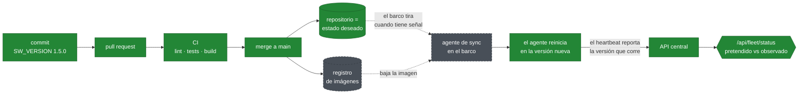

<!-- Selector de idioma. GitHub sanea el HTML, así que un enlace es la forma portable. -->
[English](README.md) · **Español**

# Desplegar en una flota real

Cómo este proyecto llegaría a doscientos barcos, y un relato honesto de dónde
termina la implementación y dónde empieza el diseño.

Nada en este directorio es ejecutable. Existe porque la parte interesante del
despliegue de una flota no es el contenedor — eso ya está resuelto — sino qué
pasa cuando la máquina a la que estás desplegando está en medio del Atlántico,
responde cuando se le da la gana, y no se puede acceder por SSH.

---

## Qué está implementado

Todo lo que sigue funciona hoy y se puede verificar con `docker compose up`.

| Pieza | Dónde | Qué hace |
|---|---|---|
| API central | [`app/`](../app) | Recibe heartbeats, deriva el estado de la flota |
| Agente de barco | [`agent/`](../agent) | Registra un nodo, reporta cada 30s |
| Imágenes | [`Dockerfile`](../Dockerfile), [`agent/Dockerfile`](../agent/Dockerfile) | Multi-stage, sin root, con healthcheck |
| Entorno | [`docker-compose.yml`](../docker-compose.yml) | El sistema completo declarado en un archivo |
| Verificación | [`.github/workflows/ci.yml`](../.github/workflows/ci.yml) | Lint, tests, build de imagen en cada cambio |

La regla de estado es la parte que vale la pena señalar: la alcanzabilidad de
un nodo se **deriva de la antigüedad de su último reporte, nunca se guarda**.
Un barco que se queda sin energía deja de reportar *y* deja de poder corregir
un estado guardado, así que una columna `status` seguiría diciendo ONLINE
indefinidamente. Comparar `last_seen_at` contra el reloj se recalcula en cada
lectura y no puede desactualizarse. Por eso el sistema detecta un barco
silencioso sin que nadie escriba nada.

---

## Los dos flujos

El despliegue de una flota tiene dos direcciones, y confundirlas es el error
habitual.

```
                    REPOSITORIO
              (declara el estado deseado)
                         │
                         │  ① el nodo tira su configuración
                         │     "¿qué debería estar corriendo acá?"
                         ▼
                  ┌─────────────┐
                  │    BARCO    │
                  │  ┌───────┐  │
                  │  │agente │  │
                  │  └───┬───┘  │
                  └──────┼──────┘
                         │  ② el nodo empuja heartbeats
                         │     "esto es lo que ESTÁ corriendo acá"
                         ▼
                   API CENTRAL  ──▶  PostgreSQL
                         │
                         ▼
                  GET /api/fleet/status
```

**El flujo ② está implementado.** Es el agente, y responde *qué hay realmente
ahí afuera* — incluida la versión de software que reporta cada barco.

**El flujo ① está diseñado, no implementado.** Es GitOps, descrito más abajo.

Los dos juntos cierran un ciclo que ninguno cierra por sí solo. El repositorio
declara que los doscientos barcos deberían estar corriendo `1.5.0`. La API
responde:

```json
{ "total": 200, "online": 187, "stale": 9, "offline": 4,
  "versions": { "1.5.0": 180, "1.4.2": 20 } }
```

Veinte barcos nunca aplicaron el cambio. **La diferencia entre lo pretendido y
lo observado es la señal operativa**, y producirla requiere los dos flujos.

---

## Cómo funcionaría el despliegue

### Por qué no empujar

El enfoque obvio es empujar: un pipeline se conecta a cada barco y lo
actualiza. Acá falla por razones específicas de este entorno.

- Un barco fuera del alcance satelital es sencillamente inalcanzable. El deploy
  "falla" para ese nodo, y ahora el operador tiene una lista de fallas que
  perseguir a mano.
- Empujar requiere que el sistema central guarde credenciales de doscientas
  máquinas, y pueda alcanzarlas de forma entrante.
- Después de un despliegue parcial, nadie sabe qué está corriendo cada barco.
  El log del deploy dice qué se *intentó*, no qué quedó.

### Tirar, en cambio

Cada barco corre un agente de sincronización que observa este repositorio y
aplica lo que encuentra. No se le empuja nada.

Las consecuencias son lo que hace que esto encaje con el problema:

- **La conectividad intermitente deja de ser un caso de falla.** Un barco fuera
  de alcance no es un deploy fallido; es un nodo que todavía no convergió.
  Sincroniza cuando puede. Sin cola de reintentos, sin persecución.
- **El repositorio es la única fuente de verdad.** Preguntar qué debería estar
  corriendo el `vessel-047` significa leer un archivo, no conectarse a un barco.
- **Un cambio es un commit** — revisado, atribuido, fechado.
- **Deshacer es `git revert`**, no acordarse de qué se tocó a las 3 de la
  mañana.
- **No hace falta acceso entrante.** Los barcos salen; nada entra.

### Estructura

```
deploy/
├── fleet/
│   ├── vessel-001.env      NODE_NAME=vessel-001
│   │                       LOCATION=North Atlantic
│   │                       SW_VERSION=1.5.0
│   ├── vessel-002.env      SW_VERSION=1.5.0
│   └── ...
└── groups/
    ├── canary.yaml         los primeros diez barcos que reciben un release
    └── conservative.yaml   barcos que se actualizan recién después del canary
```

Un release pasa a ser entonces un pull request que cambia `SW_VERSION` en un
grupo de archivos. Atraviesa revisión, CI y merge como cualquier otro cambio —
y la flota converge hacia él a medida que cada barco se reconecta.

Desplegar por olas sale naturalmente de la estructura: cambiás el grupo canary,
esperás a que `/api/fleet/status` muestre diez barcos en la versión nueva y
todavía ONLINE, y después cambiás el resto.

### La vida de un cambio



En verde, lo implementado y funcionando. En gris con borde punteado, lo
diseñado y descrito acá, no construido: el registro de imágenes y el agente de
sincronización a bordo.

### Herramientas

Para una flota que ya corre Kubernetes en el borde, **Flux** o **Argo CD** hacen
exactamente esto y son la respuesta honesta. Para barcos que corren Docker a
secas — el caso más probable en una caja industrial chica — el mismo patrón es
un temporizador de systemd que ejecuta aproximadamente:

```
git pull  →  ¿cambió algo para este nodo?
          →  docker compose pull && docker compose up -d
          →  reportar el resultado en el próximo heartbeat
```

El patrón importa más que la herramienta. Nombrar Argo CD sin poder explicar el
ciclo de reconciliación es peor que describir el ciclo.

---

## Qué no está implementado

Dicho sin vueltas, porque un README que exagera su alcance es peor que uno que
admite sus bordes.

| No implementado | Qué existe en su lugar |
|---|---|
| El agente de sincronización en el barco | Nada. Es el núcleo del flujo ① |
| `deploy/fleet/*.env` por nodo | `--scale agent=3` le da a cada réplica la misma identidad pero un nombre distinto |
| Registro de imágenes y tags versionados | CI construye imágenes y nunca las publica |
| Entrega continua | El pipeline termina en integración, a propósito |
| Secretos cifrados en Git | `.env` está ignorado; no se commitea nada cifrado |
| Autenticación en la API | Cualquier cliente que la alcance puede registrar un nodo |

---

## Problemas que este diseño no resuelve

Las partes que necesitarían trabajo real antes de que esto manejara una flota.

**Secretos.** La configuración va en Git; las credenciales no. La respuesta
habitual es SOPS o Sealed Secrets — el secreto se commitea cifrado y se
descifra en el nodo con una clave que nunca estuvo en el repositorio. Esa clave
igual tiene que llegar a doscientos barcos de alguna manera, que es el mismo
problema de distribución un nivel más abajo. Este proyecto no lo resuelve:
mantiene los secretos fuera de Git y fuera de la imagen, y los pasa en tiempo
de ejecución.

**Ancho de banda.** El build multi-stage bajó la imagen de 203 MB a 71 MB
transferidos, que en doscientos barcos son unos 26 GB ahorrados por despliegue.
En enlaces satelitales medidos eso es un costo real, no un error de redondeo —
y es la razón por la que vale la pena medir el número en lugar de suponerlo. Un
registro con caché de capas cerca de la flota ayudaría todavía más.

**Rollback sin conectividad.** Si un release rompe un barco lo suficiente como
para perder el enlace, GitOps no puede alcanzarlo para revertir — el nodo
necesita la red para enterarse de que debería volver atrás. Un barco tendría
que detectar su propia falla y caer a la imagen anterior localmente. Nada acá
hace eso.

**Diagnosticar por qué un nodo está atrasado.** `/api/fleet/status` informa
*que* veinte barcos corren una versión vieja. No puede decir por qué, y las
causas necesitan respuestas distintas: sin conectividad cuando salió el release
(se resuelve solo), disco lleno o una imagen que no arrancó (necesita
intervención), o una exclusión deliberada (es lo esperado). Cerrar esa brecha
significa que el agente reporte más: último intento de sincronización y su
error, disco libre, tiempo desde que alcanzó el repositorio por última vez. Es
la función siguiente más valiosa, y no está construida.

**Escala de la consulta de estado.** `/api/fleet/status` carga todos los nodos y
cuenta en Python. Alcanza para doscientos; con cincuenta mil debería ser una
consulta agregada en la base.

---

## La versión corta

El repositorio declara qué *debería* estar corriendo la flota. Los agentes
reportan qué *está* corriendo. La diferencia entre las dos es lo único que un
operador necesita mirar realmente.

La mitad de eso está construida y funcionando. La otra mitad está descrita acá,
y descrita como no construida.
