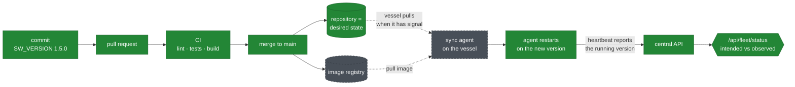

<!-- Language switcher. GitHub sanitises HTML, so a link is the portable form. -->
**English** · [Español](README.es.md)

# Deploying to a real fleet

How this project would reach two hundred vessels, and an honest account of
where the implementation stops and the design begins.

Nothing in this directory is executable. It exists because the interesting part
of a fleet deployment is not the container — that part is solved — but what
happens when the machine you are deploying to is in the middle of the Atlantic,
answers when it feels like it, and cannot be logged into.

---

## What is implemented

Everything below runs today and can be verified with `docker compose up`.

| Piece | Where | What it does |
|---|---|---|
| Central API | [`app/`](../app) | Receives heartbeats, derives fleet status |
| Vessel agent | [`agent/`](../agent) | Registers a node, reports every 30s |
| Images | [`Dockerfile`](../Dockerfile), [`agent/Dockerfile`](../agent/Dockerfile) | Multi-stage, non-root, healthchecked |
| Environment | [`docker-compose.yml`](../docker-compose.yml) | The whole system declared in one file |
| Verification | [`.github/workflows/ci.yml`](../.github/workflows/ci.yml) | Lint, tests, image build on every change |

The status rule is the part worth pointing at: a node's reachability is
**derived from the age of its last report, never stored**. A vessel that loses
power stops reporting *and* stops being able to correct a stored status, so a
`status` column would keep claiming ONLINE indefinitely. Comparing
`last_seen_at` against the clock is recomputed on every read and cannot go
stale. This is why the system detects a silent vessel without anyone writing
anything.

---

## The two flows

A fleet deployment has two directions, and conflating them is the usual mistake.

```
                    REPOSITORY
              (declares desired state)
                         │
                         │  ① node pulls its configuration
                         │     "what should be running here?"
                         ▼
                  ┌─────────────┐
                  │   VESSEL    │
                  │  ┌───────┐  │
                  │  │ agent │  │
                  │  └───┬───┘  │
                  └──────┼──────┘
                         │  ② node pushes heartbeats
                         │     "this is what IS running here"
                         ▼
                   CENTRAL API  ──▶  PostgreSQL
                         │
                         ▼
                  GET /api/fleet/status
```

**Flow ② is implemented.** That is the agent, and it answers *what is actually
out there* — including which software version each vessel reports.

**Flow ① is designed, not implemented.** That is GitOps, described below.

The two together close a loop that neither closes alone. The repository states
that all two hundred vessels should be running `1.5.0`. The API answers:

```json
{ "total": 200, "online": 187, "stale": 9, "offline": 4,
  "versions": { "1.5.0": 180, "1.4.2": 20 } }
```

Twenty vessels never applied the change. **The gap between intended and
observed is the operational signal**, and producing it requires both flows.

---

## How the rollout would work

### Why not push

The obvious approach is to push: a pipeline connects to each vessel and updates
it. It fails here for reasons specific to this environment.

- A vessel out of satellite range is simply unreachable. The deploy "fails" for
  that node, and now the operator has a list of failures to chase manually.
- Pushing requires the central system to hold credentials for two hundred
  machines, and to reach them inbound.
- After a partial rollout, nobody knows what each vessel is running. The
  deployment log says what was *attempted*, not what took.

### Pull instead

Each vessel runs a synchronisation agent that watches this repository and
applies what it finds. Nothing is pushed to it.

The consequences are what make this fit the problem:

- **Intermittent connectivity stops being a failure case.** A vessel out of
  range is not a failed deploy; it is a node that has not converged yet. It
  syncs when it can. No retry queue, no chasing.
- **The repository is the single source of truth.** Asking what `vessel-047`
  should be running means reading a file, not connecting to a ship.
- **A change is a commit** — reviewed, attributed, dated.
- **Rolling back is `git revert`**, not remembering what was changed at 03:00.
- **No inbound access is required.** Vessels reach out; nothing reaches in.

### Structure

```
deploy/
├── fleet/
│   ├── vessel-001.env      NODE_NAME=vessel-001
│   │                       LOCATION=North Atlantic
│   │                       SW_VERSION=1.5.0
│   ├── vessel-002.env      SW_VERSION=1.5.0
│   └── ...
└── groups/
    ├── canary.yaml         the first ten vessels to receive a release
    └── conservative.yaml   vessels that update only after canary is proven
```

A release is then a pull request that changes `SW_VERSION` across a group of
files. It goes through review, CI, and merge like any other change — and the
fleet converges on it as each vessel reconnects.

Rolling out in waves falls out of the structure: change the canary group, wait
for `/api/fleet/status` to show ten vessels on the new version and still
ONLINE, then change the rest.

### The life of a change



Green is implemented and running. Grey with a dashed border is designed and
described here, not built: the image registry and the on-vessel synchronisation
agent.

### Tooling

For a fleet already running Kubernetes at the edge, **Flux** or **Argo CD** do
exactly this and are the honest answer. For vessels running plain Docker — the
likelier case for a small industrial box — the same pattern is a systemd timer
running roughly:

```
git pull  →  has anything changed for this node?
          →  docker compose pull && docker compose up -d
          →  report the result on the next heartbeat
```

The pattern matters more than the tool. Naming Argo CD without being able to
explain the reconciliation loop is worse than describing the loop.

---

## What is not implemented

Stated plainly, because a README that overstates its scope is worse than one
that admits its edges.

| Not implemented | What exists instead |
|---|---|
| The synchronisation agent on the vessel | Nothing. This is the core of flow ① |
| `deploy/fleet/*.env` per node | `--scale agent=3` gives every replica the same identity but a distinct name |
| Image registry and versioned tags | CI builds images and never pushes them |
| Continuous deployment | The pipeline stops at integration, deliberately |
| Encrypted secrets in Git | `.env` is git-ignored; nothing is committed encrypted |
| Authentication on the API | Any client that can reach it can register a node |

---

## Problems this design does not solve

The parts that would need real work before this ran a fleet.

**Secrets.** Configuration belongs in Git; credentials do not. The usual answer
is SOPS or Sealed Secrets — the secret is committed encrypted and decrypted on
the node with a key that was never in the repository. That key still has to
reach two hundred vessels somehow, which is the same distribution problem one
level down. This project does not solve it: it keeps secrets out of Git and out
of the image, and passes them at run time.

**Bandwidth.** The multi-stage build cut the image from 203 MB to 71 MB
transferred, which across two hundred vessels is roughly 26 GB saved per
rollout. On metered satellite links that is a real cost, not a rounding error —
and it is why the size number is worth measuring rather than assuming. A
registry with layer caching close to the fleet would help further.

**Rollback without connectivity.** If a release breaks a vessel badly enough to
lose the link, GitOps cannot reach it to revert — the node needs the network to
learn it should roll back. A vessel would need to detect its own failure and
fall back to the previous image locally. Nothing here does that.

**Diagnosing why a node is behind.** `/api/fleet/status` reports *that* twenty
vessels are on an old version. It cannot say why, and the causes need different
responses: no connectivity when the release went out (resolves itself), a full
disk or an image that failed to start (needs intervention), or a deliberate
exclusion (expected). Closing that gap means the agent reporting more — last
sync attempt and its error, free disk, time since the repository was last
reachable. That is the most valuable next feature, and it is not built.

**Scale of the status query.** `/api/fleet/status` loads every node and counts
in Python. Fine at two hundred; at fifty thousand it should be an aggregate
query in the database.

---

## The short version

The repository declares what the fleet *should* be running. The agents report
what it *is* running. The difference between the two is the only thing an
operator actually needs to look at.

Half of that is built and running. The other half is described here, and
described as unbuilt.
